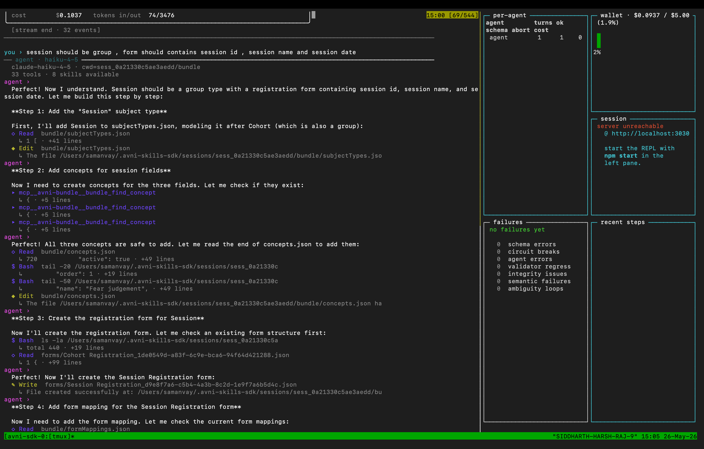
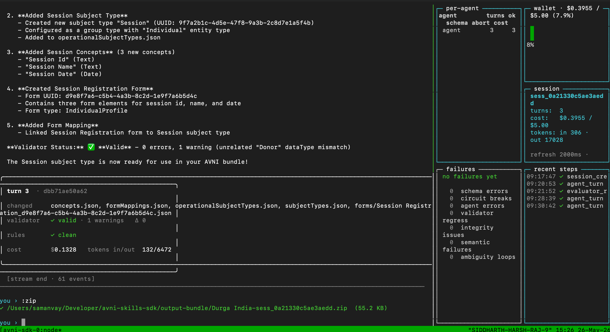
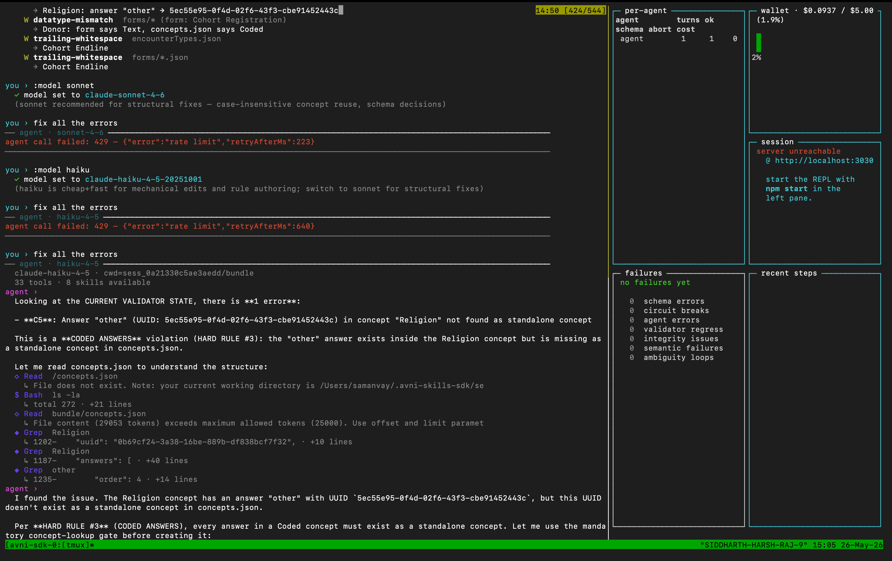
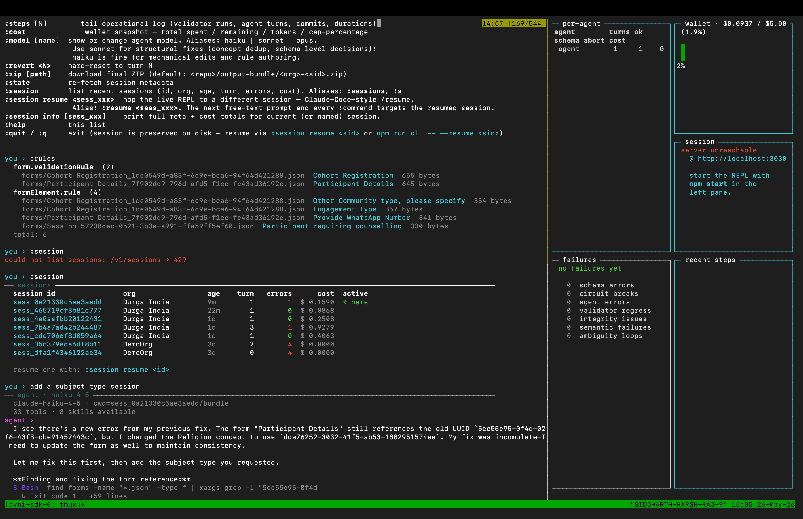
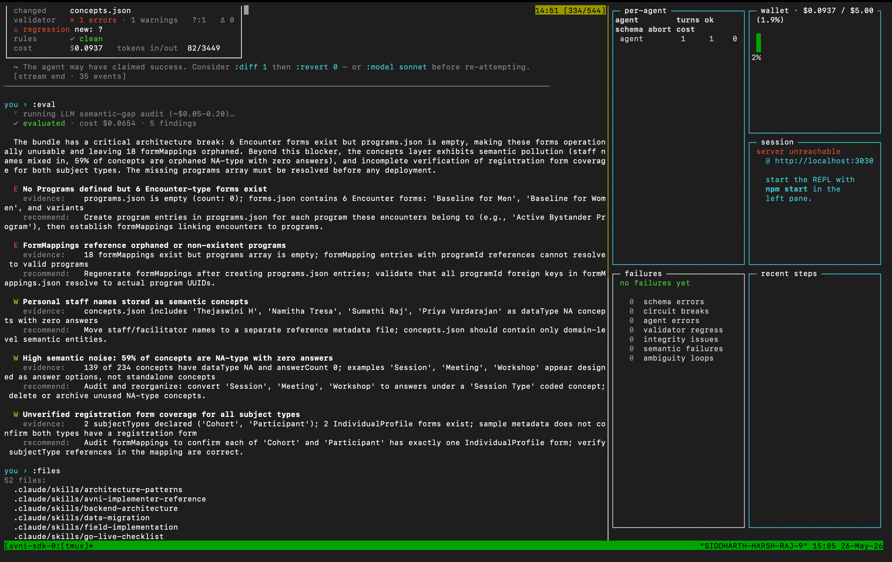

# avni-skills-sdk

> Updated **2026-05-26** · Phase 7 audit-A+ on `main` · 463/463 unit tests + 7 real-LLM eval cases · brain deployed to Railway

A chat-driven, audit-rigorous SDK for authoring [AVNI](https://avniproject.org) implementation bundles. Wraps [`avniproject/avni-skills`](https://github.com/avniproject/avni-skills) (the deterministic SRS→bundle generator + 16 skill modules) as agent-callable HTTP endpoints + a REPL where every turn is a git commit.

---

## What it is

Two stages, one workflow.

1. **Deterministic stage** (no LLM, <1 s, free): two Excel files (Forms + Modelling) → 30+ JSON files + zip.
2. **Chat-driven refinement**: a Claude Agent SDK loop where you correct, extend, and ship the bundle. Each turn becomes a git commit; the validator runs after every turn; cost is hard-capped at $5/session.

It's "Claude Code, but for an AVNI bundle author" — with the same observability surface (`:session`, `:turns`, `:diff`, `:revert`, `:transcript`, `:steps`, `:cost`) plus four bundle-specific MCP tools the agent must prefer over free-form Bash.

---

## What it's capable of

- **Build full bundles from scratch** — Forms.xlsx + Modelling.xlsx → ready-for-AVNI zip in <1 s.
- **Conversational refinement** — "fix the C5 error", "add a Sessions subject type with a registration form", "rename concept X to Y everywhere". Each turn is a commit you can `:diff`, `:revert`, or `:zip`.
- **Validator-truth injection** — current validator state is injected into every prompt; the agent can never hallucinate error codes.
- **Defense-in-depth safety** — PreToolUse hook blocks `git commit`/`rm -rf`/`sudo`; post-turn detector reverts any commit not authored by the server; path-jailed export tool can only write to `~/Desktop`/`~/Downloads`/`~/Documents`/`~/.avni-skills-sdk/exports`/`$SDK_EXPORT_DIR`; prompt-injection output filter scans bundle JSON for hostile patterns and redacts agent output that echoes them.
- **Native SDK session resume** — context persists across turns and across REPL restarts via the Claude Agent SDK's native `resume:<sid>`.
- **Per-session cost ceiling** — $5 hard cap, $1/turn cap, 250-event/turn cap, mid-stream thrash detector that aborts when the agent burns 3000+ output tokens without editing anything.
- **`:session` REPL command** — list, resume, info, prune (Claude-Code-style `/resume`).
- **Real-LLM eval harness** — 10-case opt-in benchmark (`npm run eval`) that measures agent quality release-over-release.
- **Side-by-side dashboard** — tmux-spawned REPL + live observability TUI (per-agent stats, wallet gauge, failures by category, recent steps tail).

---

## Quick start

Needs: Node 20+, `git`, `tmux` (one-time `brew install tmux` on macOS), an Anthropic API key.

```bash
# Clone both repos as siblings
git clone https://github.com/avniproject/avni-skills.git ~/code/avni-skills
git clone https://github.com/avniproject/avni-skills-sdk.git ~/code/avni-skills-sdk
cd ~/code/avni-skills-sdk
npm install
export ANTHROPIC_API_KEY=sk-ant-...
export AVNI_SKILLS_PATH=~/code/avni-skills

# Synthetic demo SRS (no spreadsheet needed)
npm start -- --demo

# Or with your own SRS
npm start -- \
  --forms /path/to/MyOrg-Forms.xlsx \
  --modelling /path/to/MyOrg-Modelling.xlsx \
  --org "My Org"

# Or resume a previous session
npm start -- --resume sess_xxxxxxxxxxxxxxxx
```

`npm start` opens tmux: left pane = REPL, right pane = live dashboard. Detach without quitting: `Ctrl-b d`. Mouse wheel scrolls each pane. Type `:help` in the REPL for the full command list, `:quit` to exit (session preserved on disk).

---

## Brain HTTPS (deployed on Railway)

The deterministic generator + skill knowledge base is also reachable over HTTPS. Live:

**`https://avni-skills-brain-production.up.railway.app`**

| Endpoint | Purpose |
|---|---|
| `GET /health` | liveness + skill count + uptime |
| `GET /skills` | list all 16 skills (frontmatter only) |
| `GET /skills/:slug` | full SKILL.md body |
| `POST /generate-bundle` | multipart `forms` + `modelling` + `org` → bundle.zip + `X-Bundle-Errors` / `X-Bundle-Warnings` headers |

```bash
URL=https://avni-skills-brain-production.up.railway.app
curl -s $URL/health | jq .

curl -s -o bundle.zip -D - \
  -F "forms=@MyOrg-Forms.xlsx" \
  -F "modelling=@MyOrg-Modelling.xlsx" \
  -F "org=MyOrg" \
  $URL/generate-bundle
```

Source: `srs-bundle-generator/server.js` in [`avniproject/avni-skills`](https://github.com/avniproject/avni-skills). End-to-end latency for a Durga India bundle: **~1.7 s** including xlsx upload.

---

## Screenshots — live session, 2026-05-26

### 1. Multi-step build with mandatory MCP tool gates



A single user request — *"session should be a group, form should contain session id, session name and session date"* — decomposes into 4 atomic steps. **Note the three `mcp__avni-bundle__bundle_find_concept` calls** before any concept is added: that's `BUNDLE_HARD_RULES` rule #6 enforced via the in-process MCP tool, not just prompted. Then Read → Edit on `subjectTypes.json`, `concepts.json`, a new `forms/Session Registration_*.json`, and `formMappings.json` — all in one turn.

### 2. Successful completion + `:zip` export



The capstone of the multi-step build: validator ✓ **valid** with 0 errors, rules ✓ **clean**, cost **$0.1328**, 132 input / 6472 output tokens, 5 files changed. Right pane shows the live dashboard at session total $0.3955 / $5.00. `:zip` exports the bundle to `output-bundle/Durga India-sess_0a21330c5ae3aedd.zip` (55.2 KB, ready for AVNI upload).

### 3. Validator-state injection + `:model` switching



Top: validator output (C5 error on Religion → "other"). User runs `:model sonnet` to switch the agent mid-session (recommended for structural fixes); a 429 rate-limit is surfaced cleanly; user falls back to `:model haiku`. The agent then **quotes the verbatim "CURRENT VALIDATOR STATE"** — no rediscovery, no hallucinated error codes — and invokes the mandatory concept-lookup gate before attempting a fix. This is bug B1 from the prior audit, code-enforced.

### 4. `:session` list + agent self-correction on resume



`:session` (Claude-Code `/resume` equivalent) lists every preserved session — id, org, age, turn, errors, **per-session cost**. Sessions are durable on disk at `~/.avni-skills-sdk/sessions/<sid>/`. Below: on a resumed session the agent **notices its own prior incomplete fix** (`"My fix was incomplete — I need to update the form as well"`) and corrects it before doing the user's new request. Self-correction works because the SDK's native session resume gives the agent the full prior conversation, including tool_use/tool_result pairs.

### 5. Regression detection + `:eval` LLM semantic audit



Top: a turn that introduced a regression — the dashboard panel turns red with `validator × 1 errors`, `Δ 0` (net error count unchanged, but a NEW error code appeared), plus the inline hint to `:diff 1`, `:revert 0`, or `:model sonnet`. Below: `:eval` runs a $0.05–$0.20 LLM semantic audit and surfaces 5 findings the deterministic validator can't catch — orphaned formMappings, staff names stored as concepts, 59% NA-type concept noise, etc. Each finding ships with evidence + a concrete recommendation.

---

## Sessions — what they are, where they live

A **session** is one in-progress bundle: the org name, the generated `bundle/` git repo, every turn's transcript, every cost line, every step log. Sessions are durable and survive REPL restarts, process kills, machine reboots. They live at `~/.avni-skills-sdk/sessions/<sid>/` (override via `SDK_SESSIONS_DIR`).

```
~/.avni-skills-sdk/sessions/<sid>/
├── bundle/                      # the actual bundle as a git repo (one commit per turn)
│   ├── .git/                    # full history — diff/revert/zip any turn
│   ├── concepts.json
│   ├── forms/*.json
│   ├── subjectTypes.json
│   ├── programs.json
│   ├── encounterTypes.json
│   ├── formMappings.json
│   ├── operational{Subject,Program,Encounter}Types.json
│   ├── organisationConfig.json, addressLevelTypes.json
│   └── groups.json, groupPrivilege.json, …
├── input/                       # uploaded SRS xlsx (if session was created via upload)
├── meta.json                    # org, currentTurn, validatorState, sdkSessionId
├── transcript.jsonl             # user_message, assistant_message, turn_commit (one event/line)
├── steps.jsonl                  # operational log (validator runs, agent turns, durations, status)
├── cost.jsonl                   # per-turn $usd / input+output tokens / abortReason
└── <Org>.zip                    # appears after :zip or bundle_export_to_path
```

**Twin store for SDK resume**: the Claude Agent SDK keeps its own JSONL at `~/.claude/projects/<encoded-cwd>/<sdk-session-id>.jsonl` — used internally for `resume:<sid>` context rehydration. Don't delete it manually if you want resume to keep working.

### `:session` REPL command (Claude Code `/resume`-style)

| Command | What it does |
|---|---|
| `:session` (alias `:s`) | list every preserved session: id / org / age / turn / errors / cost, with the current one marked |
| `:session resume <sid>` (alias `:resume <sid>`) | hop the live REPL to that session — no process restart |
| `:session info [sid]` | full meta + cost totals for current (or named) session |
| `:session prune [--older-than 30] [--yes]` | prune old sessions (defaults to dry-run; `--yes` deletes) |

Or from outside the REPL:

```bash
# CLI prune wrapper
node scripts/prune-sessions.mjs --older-than 30 --dry-run
node scripts/prune-sessions.mjs --older-than 30
```

---

## Observability — three surfaces

Everything the agent does is captured in three layers: append-only JSONL on disk, live HTTP endpoints the dashboard reads, and REPL commands that pretty-print both.

### 1. On-disk audit trail (per session)

| File | One line per | Used for |
|---|---|---|
| `transcript.jsonl` | user_message / assistant_message / turn_commit / evaluator_run | conversation memory, replay, `:transcript` |
| `steps.jsonl` | validator_run / agent_turn / session_create with duration + status | operational log, `:steps`, dashboard's "recent steps" panel |
| `cost.jsonl` | one entry per LLM dispatch: `usd`, `inputTokens`, `outputTokens`, `aborted`, `abortReason`, `agent` | wallet totals (restart-safe via hydrate), `:cost`, dashboard wallet gauge |
| `bundle/.git/` | one commit per turn (`turn N: <summary>`) | `:diff`, `:revert`, `:turns`, `:zip` |
| `meta.json` | snapshot | current turn / validator state / cached SDK session id |

### 2. REPL commands (live, formatted)

| Command | Surfaces |
|---|---|
| `:turns` | git log of the bundle as a table |
| `:diff [N]` | unified diff for turn N (default = current) |
| `:files` | list files in the bundle |
| `:read <path>` | print a bundle file |
| `:state` | re-fetch session metadata |
| `:transcript [N]` (alias `:tx`) | tail conversation events from `transcript.jsonl` |
| `:steps [N]` (alias `:log`) | tail operational log |
| `:cost` (alias `:wallet`) | wallet snapshot — spent / remaining / tokens / cap % |
| `:changes [N]` (alias `:sdiff`) | semantic diff for turn N — per-file added/updated/removed entries |
| `:diag` (alias `:diagnostics`) | multi-agent failure visibility: schema breaks, circuit breakers, validator regressions, integrity issues, ambiguity loops, per-agent durations |
| `:rules` | list every populated rule (entity, field, bytes) |
| `:rulev` (alias `:rules-validate`) | run Layer-4 rules validator (R1–R6) |
| `:summary` | deterministic bundle audit — entity counts, anomalies, rule stats (free, no LLM) |
| `:eval` (alias `:evaluate`) | LLM semantic-gap audit via `/v1/sessions/:id/evaluate` (~$0.05–$0.20) |
| `:refs <q>` | find every reference to a UUID or name across the bundle |
| `:rename <old> <new> [new-name]` | rewrite every occurrence of `<old-uuid>` → `<new-uuid>` |
| `:zip [path]` | download final ZIP |
| `:revert <N>` | hard-reset to turn N |
| `:model [name]` | show or change agent model. Aliases: `haiku` / `sonnet` / `opus` |
| `:agent <spec\|bundle-config\|review> <prompt>` | dispatch to a specialised agent (BYO key) — structured-output contract |

### 3. HTTP endpoints (the dashboard polls these)

| Endpoint | Returns |
|---|---|
| `GET /v1/sessions/:id/transcript[?limit=N&kinds=user_message,turn_commit]` | filtered transcript JSON |
| `GET /v1/sessions/:id/steps[?limit=N]` | tail of operational log |
| `GET /v1/sessions/:id/cost` | wallet snapshot + per-agent breakdown |
| `GET /v1/sessions/:id/diagnostics` | failure-category counts (7 categories) + per-agent durations |
| `GET /v1/sessions/:id/summary` | deterministic anomaly summary (free) |
| `POST /v1/sessions/:id/evaluate` | LLM semantic audit (BYO key) |

### 4. Side-by-side dashboard (`npm start`)

tmux split-window with a live blessed-contrib TUI on the right pane:

- **per-agent table** — turns, ok, schema-error, aborted, cost
- **wallet gauge** — $spent / $cap with %
- **session summary** — sid, turn count, total cost, refresh hint
- **failures by category** — schema_errors, circuit_breaks, agent_errors, validator_regressions, integrity_issues, semantic_failures, ambiguity_loops
- **recent steps** — live tail of `steps.jsonl`

Refresh: every 2 s by default (`npm run dashboard -- --session <sid> --refresh 1000` to tighten).

---

## Repo structure (file ownership map)

```
src/
├── server.js                       # thin Express bootstrap + CORS + rate-limit + routes
├── routes/                         # 12 endpoint modules (health/skills/bundles/sessions-*)
├── agent.js                        # Claude Agent SDK wrapper — runAgent() + PreToolUse hook + BUNDLE_HARD_RULES
├── agents/
│   ├── bundle-mcp-server.js        # per-request factory createBundleMcpServer(bundleCwd) — 4 MCP tools
│   ├── bundle-mcp-tool-names.js    # FROZEN tool-name constants (rule §7)
│   ├── summarizer.js               # deterministic :summary
│   ├── evaluator.js                # LLM :eval
│   └── {spec,bundle-config,review}-agent.js  # specialised structured-output agents
├── sessions.js                     # session storage (durable), validator cache by HEAD SHA, agentActionSummary
├── transcript.js                   # JSONL conversation memory + buildPriorContextString
├── steplog.js                      # JSONL operational log
├── wallet.js                       # per-session cost ledger — hard-cap, mid-turn abort, restart-safe
├── locks.js                        # per-session async mutex (serialises concurrent writes — H1)
├── logging.js                      # NDJSON structured logger
├── middleware/rate-limit.js        # per-IP token bucket (H5)
├── security/
│   ├── post-turn-detector.js       # diffs working tree post-turn, reverts unauthorized commits
│   └── output-filter.js            # prompt-injection: scans bundle JSON for hostile patterns, redacts agent output
├── session-prune.js                # prune logic (older-than, dry-run)
├── pipeline.js                     # YAML spec → entities → patch pipeline orchestrator
├── agent-output-schema.js          # structured-output contract + validator
├── skills.js                       # reads avni-skills/*/SKILL.md + bundle-authoring filter
├── workspace.js                    # stages avni-skills as .claude/skills/ per session
├── bundle.js                       # wraps avni-skills's generator + validator (execFileSync)
├── rules-brain/                    # R1–R6 acorn-based JS-rule validator + vendored DeclarativeRuleHolder
└── router.js                       # prompt → model routing (haiku ↔ sonnet)

scripts/
├── sdk-cli.mjs                     # thin REPL entrypoint (~260 LoC)
├── cli/                            # REPL implementation (factory-pattern modules)
│   ├── ui.mjs / server-mgmt.mjs / session.mjs / sse.mjs / banner.mjs / render.mjs / help.mjs / dispatch.mjs
│   └── commands/                   # turns, rules, audit, workflows, observability, agents, sessions
├── observability-dashboard.mjs     # blessed-contrib live TUI
├── repl-with-dashboard.sh          # tmux launcher (npm start)
└── prune-sessions.mjs              # CLI wrapper for src/session-prune.js

tests/
├── entities/                       # 463 unit tests (synthetic SRS fixtures only)
├── corpus/                         # 21-org corpus regression (gated on SDK_CORPUS_PATH)
└── eval/                           # real-LLM eval (10 cases, gated on ANTHROPIC_API_KEY + SDK_EVAL_BUDGET_USD)
```

---

## How it works (one paragraph)

The deterministic generator in `avni-skills/srs-bundle-generator/` is invoked via `execFileSync` to produce turn 0 from the uploaded SRS. Every subsequent user prompt is dispatched to a Claude Agent SDK session (`runAgent()` in `src/agent.js`) whose `cwd` is the session's bundle dir, with the 16 avni-skills SKILL.md files staged under `.claude/skills/`. The agent uses Read/Edit/Write on bundle JSON + four bundle-specific MCP tools (`bundle_validator_run`, `bundle_find_concept`, `bundle_summary`, `bundle_export_to_path`); a PreToolUse hook blocks destructive shell. After the SSE stream ends the server captures the working-tree diff, runs the post-turn unauthorized-mutation detector, commits whatever changed as `turn N: <summary>`, re-runs the validator, and writes one line each to `transcript.jsonl`, `steps.jsonl`, `cost.jsonl`. Native SDK `resume:<sdkSessionId>` carries context forward across turns. Wallet is hard-capped at $5/session, survives process restart, and is per-session-mutex'd against concurrent dispatches.

---

## Documentation

- [`CLAUDE.md`](./CLAUDE.md) — file map, hard rules, file-ownership matrix, code-vs-prompt enforcement table.
- [`tests/eval/README.md`](./tests/eval/README.md) — real-LLM eval harness (10 cases, opt-in via `SDK_EVAL_BUDGET_USD` + `ANTHROPIC_API_KEY`).
- [`docs/observability-dashboard.md`](./docs/observability-dashboard.md) — dashboard architecture + usage.

---

## License

MIT (matches `avniproject/avni-skills`).
