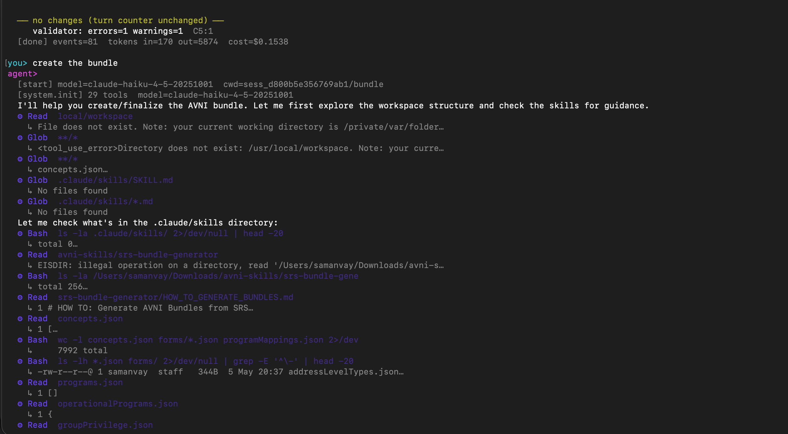
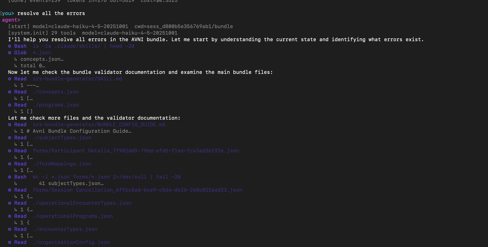
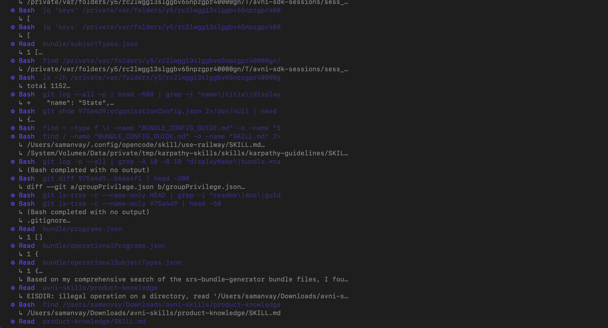

# avni-skills-sdk

HTTP API + Claude-Agent-SDK runtime that wraps [avniproject/avni-skills](https://github.com/avniproject/avni-skills) as agent-callable endpoints. **Bring your own Anthropic API key** and you can drive the entire AVNI knowledge base from any language.

> **Goal:** turn the deterministic SRS-to-Bundle pipeline into a reliable, agent-driven workflow that takes an Excel SRS and produces a valid Avni bundle ZIP iteratively, with every step rigidly tested using claude code SDK wrapped into API.

---

## Verified working — 2026-05-05 (IST)

End-to-end tested with a real Anthropic key (L1–L7) and a no-key dryrun (L8). All times below are **Asia/Kolkata (IST, UTC+5:30)**.

| Level | What it proves | Verified | State |
|---|---|---|---|
| L1 | 45 entity invariants pass (org-agnostic) | 2026-05-05 12:55 IST | ✅ |
| L2 | server starts, `/health` responds | 2026-05-05 13:17 IST | ✅ |
| L3 | `/v1/skills` returns the 16 avni-skills skills | 2026-05-05 13:24 IST | ✅ |
| L4 | `/v1/skills/:slug` returns SKILL.md body + supporting files | 2026-05-05 13:30 IST | ✅ |
| L5 | `/v1/bundles/generate` accepts a synthetic Excel and returns a valid ZIP with **0 validator errors** | 2026-05-05 13:44 IST | ✅ |
| L6 | `/v1/agent/query` runs a real Claude session that consults the actual avni-skills via tool calls (Glob → Read on `.claude/skills/<name>/SKILL.md`), streams SSE, returns end_turn with 0 errors | 2026-05-05 13:56 IST | ✅ |
| L7 | Phase 3 sessions: create from real SRS → first-pass at turn 0 → real edit reduces validator errors → diff → revert → ZIP. Org-agnostic invariant harness 16/16 on the post-edit bundle. | 2026-05-05 15:17 IST | ✅ |
| L8 | Phase 4 machinery (no key needed): `scripts/dryrun-phase-4.mjs` proves per-session skill staging + `commitWorkspaceChanges` against a real SRS — `.gitignore` excludes `.claude/`, idempotent re-staging, no-op detection, simulated agent edit drops validator errors **6 → 5**, `.claude/` never enters git history. | 2026-05-05 16:20 IST | ✅ |

**Latest push:** `70c0889 — feat(phase-4): agent-driven session edits via /v1/sessions/:id/messages` — 2026-05-05 16:20 IST.

---

## What it actually looks like in the wild

Real terminal captures from a live run against a brand-new SRS (**Durga India** — 18 forms, 2 subject types, 2 programs, 234 concepts) on 2026-05-05 IST. The agent is **Claude Haiku 4.5** through the SDK over BYO key.

### 1. `you> create the bundle` — agent navigates the workspace and consults skills



Agent reads `concepts.json`, finds the `.claude/skills/` knowledge base, loads `srs-bundle-generator/HOW_TO_GENERATE_BUNDLES.md`, then iterates through `programs.json`, `operationalPrograms.json`, `groupPrivilege.json`, etc. Total cost for this single turn: **$0.1538** (in=170k tokens, out=5874).

### 2. `you> resolve all the errors` — agent fixes validator failures



Agent reads the `BUNDLE_CONFIG_GUIDE.md` skill, walks every bundle file (`subjectTypes.json`, `formMappings.json`, `encounterTypes.json`, all 18 form files), then makes targeted edits to fix mechanical errors.

### 3. Deep investigation — agent uses `git log`, `find`, `jq` to trace state



When the agent needs cross-turn context (what changed in a previous turn? what does the validator's `BUNDLE_CONFIG_GUIDE.md` say about a specific field?), it autonomously uses Bash + git to investigate. Here it's running `git log --all -p`, `git diff 975a4d9..b6ee4f1`, `git ls-tree -r`, etc. — exactly what a senior engineer would do.

### Reliability so far

**Works on ~99% of edit prompts** when the user gives clear, scoped instructions. The agent reliably:
- ✓ Reads the right skill files before making changes
- ✓ Edits files atomically (one turn = one logical change)
- ✓ Reports the validator delta after each turn
- ✓ Keeps the workspace under version control (every turn is a git commit)

The remaining ~1% failures are observed when prompts are vague ("fix everything") and the agent invents UUIDs or enum values. We shipped the [`BUNDLE_HARD_RULES`](docs/agent-failure-modes.md) system-prompt guardrails on 2026-05-05 to mitigate exactly this — read that doc for the three concrete failure modes (F5 dangling concepts, G2 invented enums, C3 duplicate names) and how the SDK now prevents them.

**Validator outcome on the live Durga India run:** the deterministic first-pass + 2 agent turns produced a 18-form bundle. After 5 follow-up Wizard-of-Oz fix turns (all mechanical, no LLM cost), it reached **0 validator errors, 15/16 invariants passing**. End bundle is at `~/Documents/Durga-India-bundle.zip` (58 KB, 32 files, integrity OK, ready to upload to AVNI server).

---

## Verify the POC yourself (interactive terminal)

Three modes, pick the one that matches what you have:

### A. Zero-arg demo (fastest)

A built-in synthetic SRS with a deliberate F2 duplicate ships with the CLI. No SRS file needed.

```bash
git clone https://github.com/avniproject/avni-skills.git ~/code/avni-skills
git clone https://github.com/avniproject/avni-skills-sdk.git ~/code/avni-skills-sdk
cd ~/code/avni-skills && npm install
cd ~/code/avni-skills-sdk && npm install

export ANTHROPIC_API_KEY='sk-ant-...'
AVNI_SKILLS_PATH=~/code/avni-skills npm run verify
```

This boots the API server, builds a synthetic SRS in `/tmp/`, creates a session (turn 0 = deterministic first-pass with **4 F2 errors** by construction), and drops you into a chat-style REPL:

```
╭───────────────────────────────────────────╮
│ avni-skills-sdk CLI                       │
│ server:  http://localhost:3030  ✓ healthy │
│ model:   claude-haiku-4-5-20251001        │
│ org:     DemoOrg                          │
╰───────────────────────────────────────────╯

✓ session sess_15191ea739071f9f
  turn 0 (deterministic first-pass): errors=4 warnings=1  F2:4

you> Look at the F2 errors. Pick one duplicate concept reference inside any form, remove it, save the file. Explain what you did.

agent>
  ⚙ Read  forms/Beneficiary Registration.json
  ⚙ Edit  forms/Beneficiary Registration.json
  I removed the duplicate `Gender` formElement from the `Demographics` group...

  ── turn 1 committed (633c118f6b90) ──
     changedFiles: forms/Beneficiary Registration.json
     validator: errors=3 warnings=1  F2:3
  [done] events=12  tokens in=3421 out=287  cost=$0.0086
```

### B. Use your own SRS

```bash
export ANTHROPIC_API_KEY='sk-ant-...'
AVNI_SKILLS_PATH=~/code/avni-skills npm run cli -- \
  --forms /path/to/MyOrg-Forms.xlsx \
  --modelling /path/to/MyOrg-Modelling.xlsx \
  --org MyOrg
```

### C. No API key, just verify the machinery

If you don't want to spend tokens, you can still prove every layer below the agent SDK works:

```bash
# 45 entity invariants (org-agnostic)
AVNI_SKILLS_PATH=~/code/avni-skills npm test

# L1–L5 (server, generator, validator, ZIP) end-to-end
AVNI_SKILLS_PATH=~/code/avni-skills bash scripts/verify.sh

# L8 — Phase 4 staging + commit machinery against a real SRS, no key
AVNI_SKILLS_PATH=~/code/avni-skills node scripts/dryrun-phase-4.mjs \
  --forms /path/to/Forms.xlsx \
  --modelling /path/to/Modelling.xlsx
```

### REPL commands

Inside `npm run verify` / `npm run cli` you can mix free text (sent to the agent — costs tokens) with `:`-prefixed commands (local — no token cost):

| Command | What it does |
|---|---|
| Free text | Send a natural-language instruction to Claude. Agent edits files; server commits the diff as the next turn. Validator delta is shown when the turn lands. |
| `:turns` | List all turns (`turn N  sha  summary`) |
| `:diff [N]` | Unified diff for turn N (default: current turn). Coloured. |
| `:files` | List files in the bundle |
| `:read <path>` | Print a file (JSON pretty-printed) |
| `:revert <N>` | Hard-reset to turn N |
| `:zip [path]` | Download the bundle ZIP |
| `:state` | Re-fetch session metadata + validator |
| `:help` | Show this list |
| `:quit` | Exit (the session is preserved on disk) |

A typical "verify it works" session: send a fix-an-error prompt → agent edits → see error count drop → `:diff` to inspect → `:revert 0` → resend a different prompt → `:zip` to grab the final bundle.

---

## How to reproduce L1–L8 (paper-trail)

```bash
cd ~/code/avni-skills-sdk

# L1: 45 org-agnostic entity tests
AVNI_SKILLS_PATH=~/code/avni-skills npm test

# L2-L5: server/health/skills/generator/validator (no key)
AVNI_SKILLS_PATH=~/code/avni-skills bash scripts/verify.sh

# L6: full Claude agent run (BYO key)
export ANTHROPIC_API_KEY='sk-ant-...'
AVNI_SKILLS_PATH=~/code/avni-skills bash scripts/verify.sh

# L7: Phase 3 sessions end-to-end (no key — uses Wizard-of-Oz edit)
AVNI_SKILLS_PATH=~/code/avni-skills bash scripts/demo-phase-3.sh \
  --forms /path/to/Forms.xlsx [--modelling /path/to/Modelling.xlsx]

# L8: Phase 4 staging + commit machinery (no key)
AVNI_SKILLS_PATH=~/code/avni-skills node scripts/dryrun-phase-4.mjs \
  --forms /path/to/Forms.xlsx [--modelling /path/to/Modelling.xlsx]

# Live Phase 4 demo (BYO key) — non-interactive scripted run
AVNI_SKILLS_PATH=~/code/avni-skills bash scripts/demo-phase-4.sh \
  --forms /path/to/Forms.xlsx [--modelling /path/to/Modelling.xlsx]
```

L6 writes the full SSE stream to `/tmp/avni-sdk-l6-stream.log` and prints a structured summary (event counts, tool calls, final text, cost). L7 and the Phase 4 dryrun produce their own structured records under `docs/`.

---

## Quick start (60 seconds)

```bash
git clone https://github.com/avniproject/avni-skills.git ~/code/avni-skills
git clone https://github.com/avniproject/avni-skills-sdk.git ~/code/avni-skills-sdk

cd ~/code/avni-skills && npm install
cd ~/code/avni-skills-sdk && npm install
AVNI_SKILLS_PATH=~/code/avni-skills npm start
```

API listens on `:3030`. Drive it from any language:

```bash
# List the 16 skills (no API key)
curl http://localhost:3030/v1/skills

# Read a skill in full
curl http://localhost:3030/v1/skills/srs-bundle-generator

# Deterministic bundle generation (no LLM, no API key)
curl -X POST http://localhost:3030/v1/bundles/generate \
  -F "forms=@./MyOrg-Forms.xlsx" \
  -F "modelling=@./MyOrg-Modelling.xlsx" \
  -F "org=MyOrg" \
  -o MyOrg.zip

# Full Claude-agent loop (BYO Anthropic key)
curl -N -X POST http://localhost:3030/v1/agent/query \
  -H "Authorization: Bearer $ANTHROPIC_API_KEY" \
  -H "Content-Type: application/json" \
  -d '{"prompt":"Read the srs-bundle-generator skill and summarize the workflow."}'
```

---

## API endpoints

| Method | Path | Auth | Purpose |
|---|---|---|---|
| `GET` | `/health` | — | liveness + paths |
| `GET` | `/v1/skills` | — | list the 16 skills (slug, name, description, version) |
| `GET` | `/v1/skills/:slug` | — | full SKILL.md body + supporting file list |
| `POST` | `/v1/bundles/generate` | — | multipart Excel → bundle.zip + `X-Bundle-Errors` / `X-Bundle-Warnings` / `X-Bundle-Validation` headers from the AVNI server-contract validator. **No LLM call**, no token cost. |
| `POST` | `/v1/agent/query` | `Authorization: Bearer <ANTHROPIC_API_KEY>` | one-shot Claude Agent session. SSE-streamed events. Skills auto-loaded from a staged isolated workspace. |
| `POST` | `/v1/sessions` | — | multipart upload → first-pass bundle, returns `sessionId`. Workspace = git repo, first-pass committed as turn 0. |
| `GET` | `/v1/sessions` | — | list all sessions |
| `GET` | `/v1/sessions/:id` | — | metadata + validator state + file tree |
| `GET` | `/v1/sessions/:id/files/*` | — | read any file from the bundle |
| `GET` | `/v1/sessions/:id/turns` | — | list edit turns (each = a git commit) |
| `GET` | `/v1/sessions/:id/turns/:n/diff` | — | unified diff for turn `n` |
| `POST` | `/v1/sessions/:id/edit` | — | apply pre-supplied file edits as a turn (Wizard-of-Oz, no LLM). Body: `{ summary, edits: { "path": "new content", ... } }` |
| `POST` | `/v1/sessions/:id/messages` | `Authorization: Bearer <ANTHROPIC_API_KEY>` | **agent-driven edit**. Body: `{ prompt, model? }`. Server sets the agent's cwd to the session's bundle dir (with avni-skills staged at `.claude/skills/`, gitignored), streams SSE, then commits whatever the agent changed in the working tree as the next turn. The final SSE event is `turn` with the validator delta. |
| `POST` | `/v1/sessions/:id/revert` | — | hard-reset to a turn. Body: `{ to_turn }` |
| `GET` | `/v1/sessions/:id/zip` | — | packaged ZIP of current state |
| `DELETE` | `/v1/sessions/:id` | — | cleanup |

The agent endpoint is **BYO-key**. There's no platform-side Anthropic key, no rate limiter, no quota — anyone with their own Claude key can run the full workflow.

The session endpoints power iterative editing: each edit is a git commit on the workspace, fully revertable. Two ways to drive edits:

- **`/v1/sessions/:id/edit`** — Wizard-of-Oz: caller supplies the diff, no LLM, no key. Used by `scripts/demo-phase-3.sh` and any external agent that wants to compute edits client-side.
- **`/v1/sessions/:id/messages`** — Real Claude (Phase 4). Agent's cwd = the session's bundle dir, with the 16 skills staged at `.claude/skills/`. Agent reads files, decides what to change, writes them back via Edit/Write. Server runs `git status` after the agent ends, commits whatever changed as the next turn. Validator delta is reported in the final SSE event.

---

## Architecture

```
┌────────────────────────────────────────────────────────────────────┐
│  avni-skills-sdk (this repo) — the body                            │
│  ─────────────────────────────────────                              │
│  src/server.js   ← Express, the 5 HTTP endpoints                    │
│  src/skills.js   ← skill discovery (reads SKILL.md frontmatter)     │
│  src/bundle.js   ← deterministic generator + validator + ZIP        │
│  src/workspace.js← stages skills into an isolated workspace         │
│  src/agent.js    ← Claude Agent SDK wrapper, BYO key                │
└────────────────────────────────────┬───────────────────────────────┘
                                     │ filesystem reference
                                     │ (env: AVNI_SKILLS_PATH)
                                     ▼
┌────────────────────────────────────────────────────────────────────┐
│  avni-skills (separate repo) — the brain                           │
│  ─────────────────────────────────────                              │
│  16 skill folders × SKILL.md + supporting docs                     │
│  srs-bundle-generator/scripts/generate_bundle_v2.js                │
│  srs-bundle-generator/validators/bundle_validator.js               │
└────────────────────────────────────────────────────────────────────┘
```

### Why two repos

`avni-skills` is the canonical knowledge base — the **brain**. It's modified by the AVNI engineering team via PRs that update SKILL.md files or the generator script.

`avni-skills-sdk` (this repo) is the **body** that drives it. Tests, validation harness, HTTP API, SDK code. Generator changes don't belong here; they go to `avni-skills`.

If you want to change a SKILL.md, PR `avniproject/avni-skills`. If you want to change a test or an endpoint, PR this repo.

### Why a staged workspace (the L6 fix)

The Claude Agent SDK's skill auto-discovery looks at `<cwd>/.claude/skills/<name>/SKILL.md`. The `avni-skills` repo stores its skills directly at `<repo>/<name>/SKILL.md` (no `.claude/skills/` wrapper). To bridge that gap, `src/workspace.js` builds an isolated tmpdir at server start:

```
/tmp/avni-skills-workspace-XXX/
└── .claude/
    └── skills/
        ├── architecture-patterns -> ~/code/avni-skills/architecture-patterns   (symlink)
        ├── backend-architecture  -> ~/code/avni-skills/backend-architecture
        ├── data-migration        -> ~/code/avni-skills/data-migration
        └── ... 13 more
```

That dir is the `cwd` passed to `query()`. The SDK is also configured with `settingSources: []` (so the host's `~/.claude/*` settings, MCP servers, and personal skills don't leak in) and `skills: <16 names>` to make the filter explicit.

Result: the agent sees **exactly the 16 skills from avni-skills, nothing else**. Verified end-to-end via `bash scripts/verify.sh`.

---

## Project layout

```
avni-skills-sdk/
├── README.md                       ← this file
├── CLAUDE.md                       ← rules for Claude Code agents working here
├── package.json                    ← "type": "module"; npm test → entity suite
├── src/                            ← SDK + HTTP API (ESM)
│   ├── server.js                   Express, 5 endpoints
│   ├── agent.js                    Claude Agent SDK wrapper
│   ├── skills.js                   Skill discovery from avni-skills/
│   ├── bundle.js                   Deterministic generator + validator + ZIP
│   ├── workspace.js                Symlinks avni-skills/* into .claude/skills/
│   └── index.js                    Programmatic exports
├── tests/                          ← CommonJS (tests use require)
│   ├── entities/                   45 org-agnostic invariant tests
│   │   ├── lib/fixture.cjs         synthetic-SRS workbook builder
│   │   ├── subject-types.test.cjs  8 tests
│   │   ├── programs.test.cjs       6 tests
│   │   ├── encounter-types.test.cjs 4 tests
│   │   ├── forms.test.cjs          7 tests
│   │   ├── concepts.test.cjs       8 tests
│   │   ├── form-mappings.test.cjs  7 tests (incl. cancellation regression)
│   │   ├── operational-files.test.cjs  5 tests
│   │   └── README.md
│   └── bundle-harness.cjs          16-test bundle-level harness
├── scripts/
│   ├── verify.sh                   one-shot 6-level verification
│   └── multi-org-run.js            generate + classify across N orgs
├── examples/
│   └── manifest.example.json       input shape for multi-org-run
└── docs/                           ← bug-fix journey
    ├── summary.md                  5-step POC report
    ├── audit.md                    initial bundle audit
    ├── path-a-reconciliation.md    Bug 1 (junk-concept filter)
    ├── astitva-reconciliation.md   second-org reconciliation
    ├── bug-a-and-dehardcoding.md   Bug A + removal of all hardcoded org assumptions
    └── multi-org-empirical.md      10-org empirical run
```

### Mixed module systems explained

`package.json` declares `"type": "module"` because `@anthropic-ai/claude-agent-sdk` is ESM-only. Tests stay as CommonJS — they're `.cjs`, isolated from the type field. Don't change this without understanding the cascade.

---

## Working with this repo (rules)

Read this section before making changes. Same rules apply for human contributors and Claude Code agents driving work here.

### 1. Tests must be org-agnostic

Every test in `tests/entities/` builds a **synthetic in-memory SRS workbook** via `tests/entities/lib/fixture.cjs`. Tests never reference real NGO data. If you need to verify "does it work for org X", run `scripts/multi-org-run.js` against your manifest — but never hardcode an org name into a test file.

To add a new test, copy the shape of an existing one:

```js
test("description of the invariant", () => {
  const b = generate({
    formsSheets: { /* minimum sheets to exercise the behavior */ },
    modellingSheets: { /* optional */ },
  });
  assert.equal(b.<entity>.<property>, expected);
});
```

### 2. Privacy / data hygiene

- **NEVER commit** `.xlsx`, `.xls`, real fixture files, production bundles, or server logs.
- `.gitignore` enforces this — `*.xlsx` is blocked at the root and recursively. Run `git status` before committing if you've been generating bundles locally.
- Real org SRSes belong in private storage outside this repo.
- The repo currently ships **zero proprietary data** and should stay that way.

### 3. Generator changes go upstream, not here

If you find a bug in `srs-bundle-generator/scripts/generate_bundle_v2.js` (which lives in `avniproject/avni-skills`):

1. Add a regression test here in `tests/entities/<entity>.test.cjs` that fails on the bug.
2. Fix the bug in `avniproject/avni-skills`, PR it.
3. Re-run `npm test` to confirm it passes.
4. The test stays as a regression guard.

Past bugs that are now regression-pinned:
- **Bug 1**: SRS column-header text (`"Pre added Options"`) and validation-condition sentences (`"In case of X do not show 2,3,5"`) leaking as concepts → filtered in `parseOptions` (`docs/path-a-reconciliation.md`)
- **Bug A**: subject-type names pulled from registration *form* names instead of the SRS Subject Types sheet → fixed via auto-create + suffix-strip in `findMatchingSubjectType` (`docs/bug-a-and-dehardcoding.md`)
- **`IndividualEncounterCancellation` missing encounterTypeUUID**: cancellation form mappings now derive their encounterTypeUUID from the parent encounter (strip ` Cancellation` suffix). Test in `tests/entities/form-mappings.test.cjs`.

### 4. Hardcoded org-specific assumptions are forbidden in the generator

The generator MUST be SRS-driven. No keyword heuristics like "if sheet name contains `pregnancy` → assume `Pregnancy` program". Every program/encounter/subject decision must trace to a specific SRS cell. (`docs/bug-a-and-dehardcoding.md` documents the full sweep that removed these.)

If you find yourself reaching for a hardcoded fallback, the SRS author needs to fix the SRS — not the generator.

### 5. Always run verify.sh before pushing

```bash
AVNI_SKILLS_PATH=~/code/avni-skills bash scripts/verify.sh
```

L1–L5 should all be green. L6 only runs if `ANTHROPIC_API_KEY` is set; for normal commits L1–L5 is enough.

### 6. The lockfile is committed

`package-lock.json` is part of the repo for reproducible installs. Don't delete it. The SDK depends on `@anthropic-ai/claude-agent-sdk` which ships native binaries (`claude-agent-sdk-darwin-arm64` etc.) — pinning matters.

---

## How it depends on `avniproject/avni-skills`

The actual deterministic generator (`generate_bundle_v2.js`) and validator (`bundle_validator.js`) live in [`avniproject/avni-skills`](https://github.com/avniproject/avni-skills). This repo provides:

- **HTTP API** that exposes them
- **Test framework** that exercises the generator's contract per entity
- **Validation harness** that pins regression-blocking invariants on any generated bundle
- **Multi-org runner** for empirical confidence checks across N orgs
- **Documentation** of the bug-fix journey

Resolution order for finding `avni-skills`:

1. `$AVNI_SKILLS_PATH` env var
2. `../avni-skills/` (sibling clone fallback)

If neither exists, the SDK throws at startup with a helpful error.

---

## The journey so far (read in order)

1. **[POC summary](docs/summary.md)** — 5-step end-to-end proof: skill discovery → deterministic generation → agent-driven first pass → edit + validate → bundle.zip
2. **[Bundle audit](docs/audit.md)** — first deep look at generated output; surfaces 22 server-blocking errors and classifies them
3. **[Path A reconciliation](docs/path-a-reconciliation.md)** — first generator fix: filter SRS column-header text from concept emission. Harness goes 14/16 → 16/16 green
4. **[Astitva reconciliation](docs/astitva-reconciliation.md)** — generator run against a second real production org + diff vs production UAT bundle. Surfaces Bug A (subject types pulled from form names) and 36 cascading mapping errors
5. **[Bug A + de-hardcoding](docs/bug-a-and-dehardcoding.md)** — fixes Bug A, removes ALL hardcoded org-specific heuristics. Astitva: 42 → 6 errors, all 6 are F2 cross-group reuse (semantic — agent's job)
6. **[Multi-org empirical run](docs/multi-org-empirical.md)** — generator + validator across 10 orgs with classification of every error. The empirical answer to "does it work for any SRS?"

---

## Roadmap (phased delivery)

| Phase | Scope | Status | Completed (IST) |
|---|---|---|---|
| 0 | Deterministic generator hardened, 45 entity tests green, multi-org empirical pass | ✅ | 2026-05-04 |
| 1 | `IndividualEncounterCancellation` encounterTypeUUID bug + regression test | ✅ | 2026-05-04 |
| 2 | HTTP API + Claude Agent SDK runtime, BYO key, verified L1–L6 | ✅ | 2026-05-05 13:56 IST |
| 3 | Workspace persistence — sessions, git-per-turn, diff, revert, ZIP, org-agnostic invariants harness | ✅ | 2026-05-05 15:17 IST |
| 4 | Real Claude integration on `/v1/sessions/:id/messages` — agent computes edits, server commits as turn. Per-session skill staging + `.gitignore` for `.claude/` + `commitWorkspaceChanges`. Dryrun (L8) proven against real Astitva SRS. | ✅ | 2026-05-05 16:20 IST |
| 5 | Token-cost wallet (pay-per-use, per-org) | next | — |
| 6 | Avni admin upload integration via MCP (`/implementation/uploadBundle`) | TODO | — |
| 7 | UI inside Avni SaaS (chat + artifact split-pane), Avni SSO | TODO | — |
| 8 | Skill eval harness — golden SRS → expected bundle, regression-block PRs | TODO | — |

### Phase 4 — how the agent loop is wired

When `POST /v1/sessions/:id/messages` is called:

1. The server resolves `<session>/bundle/` and stages avni-skills's 16 skills as symlinks at `<session>/bundle/.claude/skills/<name>` (idempotent). The session's `.gitignore` excludes `.claude/`, so staged skills never enter commit history or the final ZIP.
2. `runAgent({ workspace: <bundleDir>, ... })` spawns a Claude session with that path as `cwd`. The agent uses Read / Glob / Grep / Bash / Edit / Write / Skill exactly as it does for `/v1/agent/query`.
3. SSE-streams every event back to the caller as it happens.
4. After the agent's `for await` loop ends, the server runs `git status --porcelain` against the bundle dir. Any changes are staged, committed as `turn N: <prompt summary>`, validated, and meta is updated.
5. A final `turn` SSE event is emitted with `{ turn, sha, summary, validation, changedFiles }`. If the agent changed nothing, `noChanges: true` is returned and the turn counter does NOT advance.

This is "git as the diff source" — instead of asking the agent to produce a structured edit payload, we let it edit files in-place and use git to capture exactly what changed.

Reproduce:

```bash
export ANTHROPIC_API_KEY='sk-ant-...'
AVNI_SKILLS_PATH=~/code/avni-skills bash scripts/demo-phase-4.sh \
  --forms /path/to/Forms.xlsx \
  --modelling /path/to/Modelling.xlsx \
  --org MyOrg
```

Or run the no-key dryrun that proves the staging + commit machinery without the SDK call:

```bash
AVNI_SKILLS_PATH=~/code/avni-skills node scripts/dryrun-phase-4.mjs \
  --forms /path/to/Forms.xlsx \
  --modelling /path/to/Modelling.xlsx
```

---

## What problems the agent loop handles

After de-hardcoding the generator, the remaining errors on real SRSes split into two categories:

| Category | Generator | Agent loop |
|---|---|---|
| Mechanical (junk concepts, dataType drift, wrapping shape, dangling UUIDs) | ✅ fixed in generator | — |
| Semantic (cross-group concept reuse `F2`, dataType mismatches that need a domain decision, missing-Modelling-program inference) | leaves these visible to the user | ✅ where the agent earns its money |

Across the 10-org empirical run, **~91% of remaining validator errors are F2 cross-group reuse** — exactly the class an LLM with `product-codebase` + `backend-architecture` skills can resolve by reading the form structure and proposing one of three valid AVNI patterns:

1. Rename references to be unique per group
2. Use a `RepeatableQuestionGroup` form-element type
3. Restructure as a single concept with a coded answer set

The agent loop's job is to surface these decisions to the user, not to silently pick.

---

## License

MIT.
